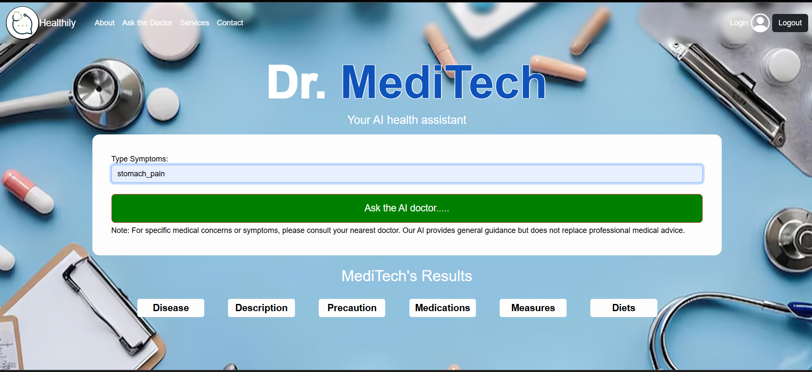

# 🩺 MediTech - AI-Powered Healthcare Chatbot



**MediTech** is an intelligent AI-based healthcare assistant that helps users identify possible diseases based on symptoms. It offers personalized suggestions on medications, diet, precautions, and workouts. Built using Flask and machine learning, MediTech enhances health literacy and self-care.

---

## 🚀 Features

- 🧠 Symptom-based disease prediction using ML
- 🔒 Secure user registration and login (with bcrypt hashing)
- 📋 Detailed disease information: descriptions, medications, precautions, workouts, and diet
- 🖥️ Interactive web interface with user-friendly pages
- 💾 User data stored in a secure SQLite database

---

## 🛠️ Tech Stack

| Area       | Technology               |
|------------|--------------------------|
| Backend    | Python, Flask            |
| Frontend   | HTML, CSS, Bootstrap     |
| ML Model   | Scikit-learn (SVC model) |
| Database   | SQLite + SQLAlchemy      |
| Security   | bcrypt (password hashing)|

---

## 📂 Project Structure

```
Meditech/
│
├── templates/
│   ├── index.html
│   ├── about.html
│   ├── blog.html
│   ├── contact.html
│   ├── services.html
│   ├── register.html
│   └── login.html
│
├── static/
│   └── homepage.png
│
├── datasets/
│   ├── symtoms_df.csv
│   ├── precautions_df.csv
│   ├── workout_df.csv
│   ├── description.csv
│   ├── medications.csv
│   └── diets.csv
│
├── model/
│   └── svc.pkl
│
├── main.py
├── requirements.txt
└── README.md
```

---

## 🧠 Dataset Files

- `symtoms_df.csv` – Mapping of symptoms to diseases
- `precautions_df.csv` – List of recommended precautions
- `workout_df.csv` – Suggested exercises per disease
- `description.csv` – Disease definitions and explanations
- `medications.csv` – Common medicines for each condition
- `diets.csv` – Nutrition and food guidance per disease

---

## 🔧 Setup Instructions

### 1. Clone the repository

```bash
git clone https://github.com/your-username/Meditech.git
cd Meditech
```

### 2. Install dependencies

```bash
pip install -r requirements.txt
```

### 3. Ensure the following files and folders exist

- `model/svc.pkl`
- All `datasets/*.csv` files
- `static/homepage.png` image

### 4. Run the Flask application

```bash
python main.py
```

### 5. Open in browser

Visit: [http://localhost:5000](http://localhost:5000)

---

## 📷 Preview


---

## 🧪 Sample Usage

1. Register a new user or login.
2. Enter your symptoms separated by commas (e.g., `headache, nausea, fever`).
3. Get real-time prediction, description, medications, diet, and more.
4. Use navigation links to explore more sections like `About`, `Blog`, and `Contact`.

---

## ✅ Requirements

```txt
flask
flask_sqlalchemy
bcrypt
numpy
pandas
scikit-learn
```

> You can install them with:
```bash
pip install flask flask_sqlalchemy bcrypt numpy pandas scikit-learn
```

---

## 📈 Future Enhancements

- 🔊 Voice interaction for input/output
- 🧬 Enhanced ML model with more data and accuracy
- 📊 Admin dashboard for managing users and datasets
- 📞 Integration with telehealth services and APIs

---


> © 2025 MediTech. All rights reserved.
